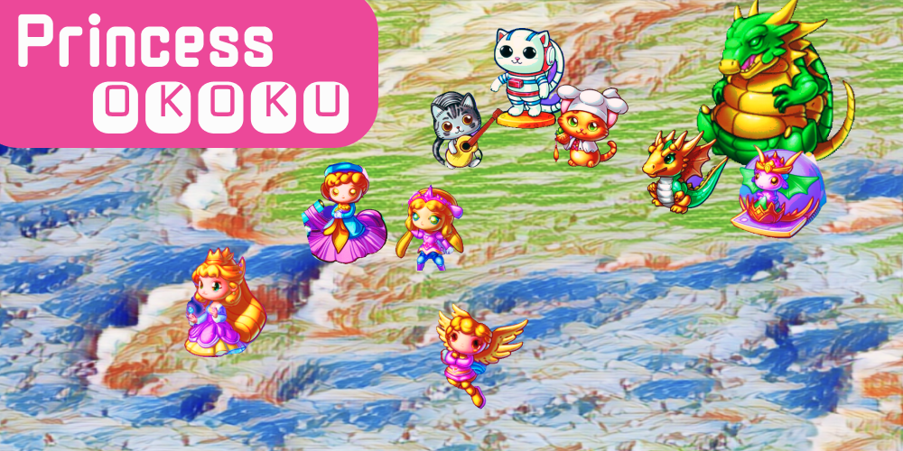
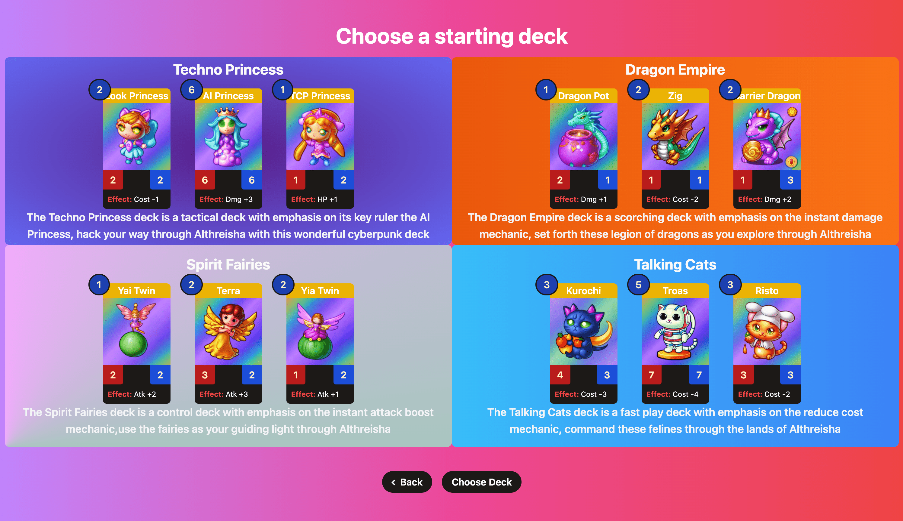
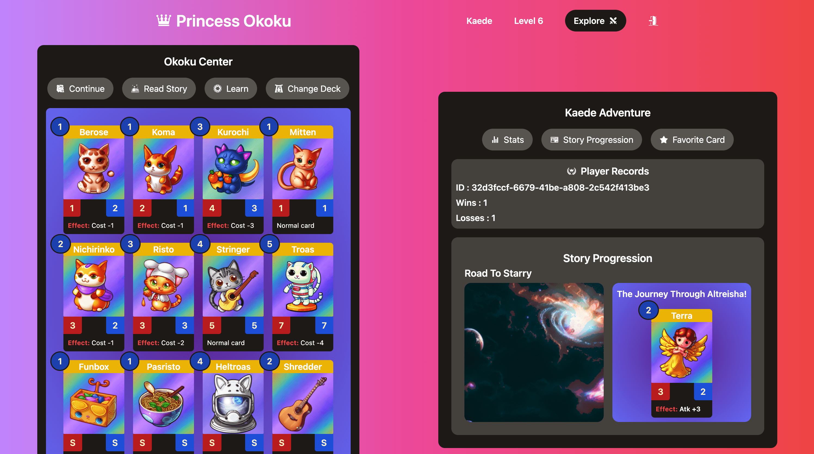
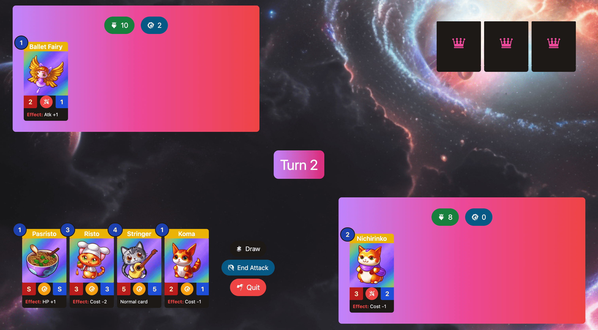

# Princess Okoku

Princess Kaede has lost its way in the kingdom of Althreisha. Help her find her way back home by exploring unique worlds and wondrous creatures. From dragons, cyberpunk princesses, fairies and, talking cats in the space Althreisha awaits.

Use strategic thinking to command a deck of unique creatures, each with their own special abilities, to reveal the the secret of the kingdom. Explore the kingdom to unlock the power of other decks that can aid you in your adventure.

## Game Mechanics

### Choosing a deck

At the beginning of the game, you will be able to pick a deck of your choice to start the adventure (Techno Princesses, Dragon Empire, Spirit Fairies, Taking Cats). All the rest of the decks can be unlocked by playing the story.

### Okoku Center

The Okoku center is the player's dashboard, in there players can change decks, read the story, and see their playthrough stats. For more information about all the features in the game, head over the **Learn** module in the Okoku center.

### Battle Phases

Each battle consists of 3 main phases:

1. Draw phase: The first phase of a battle consists of drawing a card from the deck by selecting draw.

2. Battle phase: The second phase of a battle consists of organizing cards in your play field, such card has the invocation logo active (1). However, invocations are only possible if enough energy is available. After having a card on the field, it can attack the opponent board(2). If the opponent has cards, then you must clear the field. Otherwise, you can attack its lifepoints directly.

3. End phase: Once the attack has been finished, you can finish the turn by selecting end attack phase.

### Win conditions

There are mainly two win conditions in Princess Okoku. 

1. If a player reaches 0 lifepoints, then the other player wins.

2. If a player reaches 0 cards in their deck, then the other player wins.
